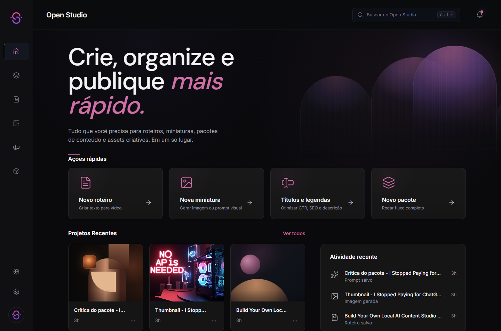
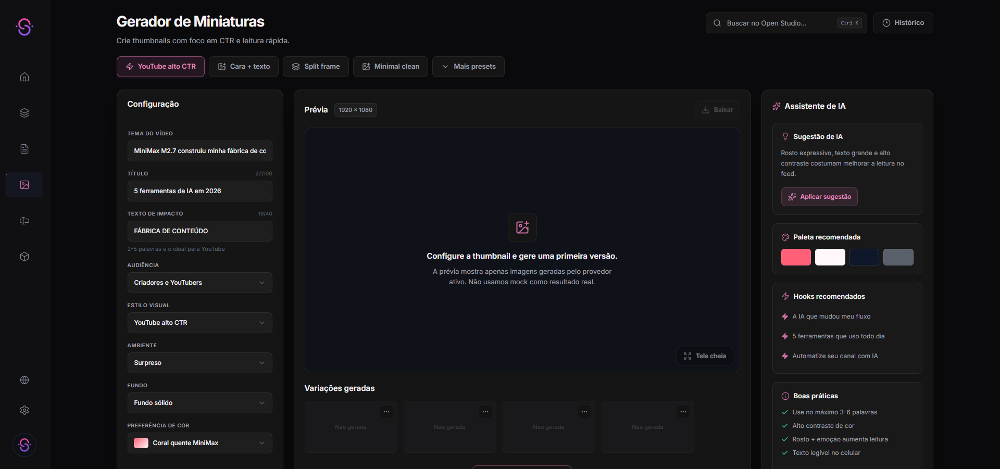
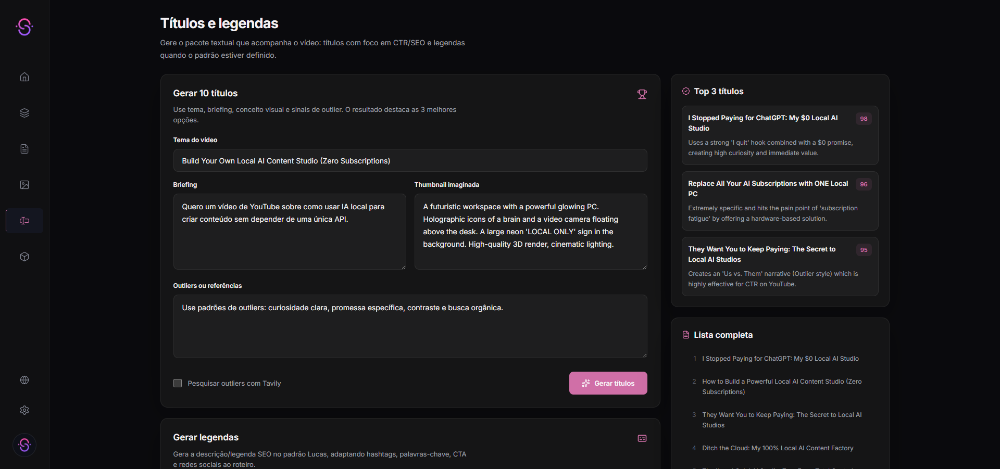
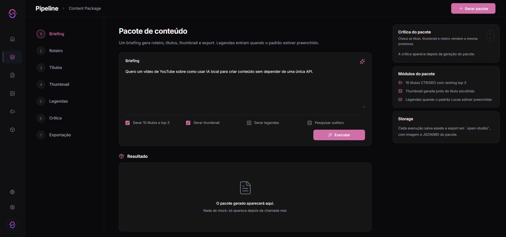
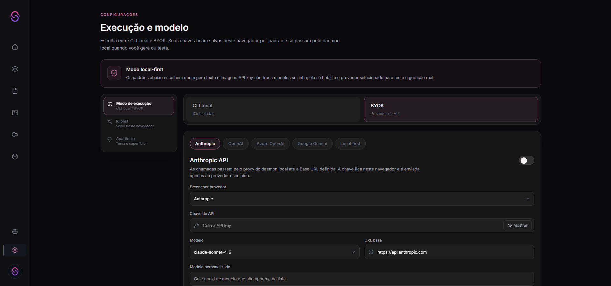
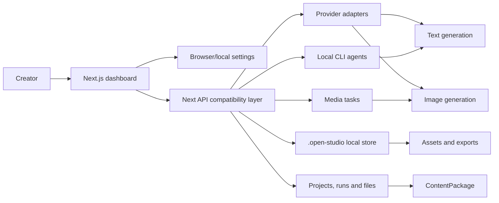

<div align="center">


# Open Studio

### Local-first AI content studio for scripts, thumbnails, titles, captions, packages and creator workflows.

[](./LICENSE)
[](https://nextjs.org)
[](https://react.dev)
[](https://www.typescriptlang.org)
[](#local-first-architecture)
[](#providers-and-models)
[](#languages)

Open Studio turns a raw video idea into a publishable content package: script, CTR/SEO title options, thumbnail images, captions/descriptions, assets, critique and exports.

Built for creators who want a real production tool, not a pretty mockup.

</div>

---

## Preview

<p align="center">
  
</p>

<details open>
<summary><strong>More real screenshots</strong></summary>

| Thumbnails | Titles and captions |
|---|---|
|  |  |

| Pipeline | Settings |
|---|---|
|  |  |

</details>

---

## What Open Studio Does

Open Studio is a content operations workspace for video creators. The product goal is simple:

> Start with a brief. Leave with a complete publishing package.

It currently focuses on:

- **Scripts** for YouTube, Shorts, tutorials, reviews and creator videos.
- **Real thumbnail image generation** with batch quantity control.
- **10 CTR/SEO title candidates** with a top-3 ranking.
- **Captions/descriptions** using a high-SEO structure with keywords, hashtags, links and social blocks.
- **Content packages** that bind script, title, thumbnail, captions, critique and export metadata.
- **Assets and exports** stored locally.
- **Local-first execution** with browser settings, BYOK providers and local CLI agents.
- **Project/run infrastructure** inspired by OpenDesign-style daemon workflows.

Open Studio is not only a UI. The app has provider adapters, local storage, daemon-compatible routes, agent CLI detection, project files, run events, media tasks, research hooks and generation APIs.

---

## Why It Exists

Most creator tools are split across too many places:

- one tab for scripts;
- another tool for thumbnails;
- another page for captions;
- another spreadsheet for title ideas;
- another folder for assets.

Open Studio tries to collapse that into one local-first workflow where title, thumbnail, script and caption are treated as one delivery package.

That matters because a video does not win with one isolated output. The title and thumbnail need to match. The script needs to support the promise. The caption needs to reinforce search. The package needs to be exportable.

---

## Quick Start

### Requirements

- Node.js 20+ recommended.
- npm.
- A provider key for paid providers, or a local CLI / local LLM if you want local-first text generation.
- Optional: Pollinations for quick image testing without an API key.

### Install

```bash
git clone https://github.com/vivieches/open-studio.git
cd open-studio
npm install
```

### Configure environment

```bash
cp .env.example .env.local
```

You can start with almost nothing configured and use the Settings screen later. Useful environment variables:

```env
# Demo mode: UI + mock/demo outputs
NEXT_PUBLIC_DEMO_MODE=false

# MiniMax
MINIMAX_API_KEY=
MINIMAX_BASE_URL=https://api.minimax.io

# OpenAI
OPENAI_API_KEY=
OPENAI_BASE_URL=https://api.openai.com/v1

# Gemini
GEMINI_API_KEY=
GEMINI_BASE_URL=https://generativelanguage.googleapis.com

# Pollinations: optional for basic image tests
POLLINATIONS_API_KEY=
POLLINATIONS_BASE_URL=https://gen.pollinations.ai

# Local storage
LOCAL_STORAGE_DRIVER=json
```

### Run the app

```bash
npm run dev
```

Open:

```text
http://localhost:3000
```

### Optional local daemon

The standalone daemon is available for local runs, health, logs and run lifecycle experiments:

```bash
npm run daemon
npm run daemon:health
```

Default daemon URL:

```text
http://127.0.0.1:7456
```

---

## Tutorial: From Idea To Package

### 1. Choose language

Use the globe button or Settings page.

Supported UI and generation languages:

- Portuguese Brazil: `pt-BR`
- Spanish Spain: `es-ES`
- English US: `en-US`

The selected language controls new scripts, titles, captions and visible text instructions.

For image providers, Open Studio writes the technical image prompt in English for better model performance, but enforces this rule:

> Any visible text inside the generated image must be in the selected language.

### 2. Configure execution

Go to **Settings**.

You can choose:

- **CLI local**: use detected local agent CLIs for text/agent work.
- **BYOK**: use your own API keys in the browser/local settings.
- **Text defaults**: provider and model for script/title/caption/package text.
- **Image defaults**: provider and model for thumbnail/image generation.

The app can detect local CLIs such as Claude Code, Codex CLI, Gemini CLI, OpenCode and others. Detection scans PATH and local toolchain folders.

Important: local text CLIs do not automatically generate pixels. Image generation still needs an image provider or the media tool contract.

### 3. Generate a script

Open **Roteiros / Scripts**.

Provide:

- topic or brief;
- audience;
- tone;
- duration;
- language.

The result is saved as a local asset and can be reused by content/package routes.

### 4. Generate thumbnails

Open **Miniaturas / Thumbnails**.

You can configure:

- video topic;
- title;
- impact text;
- audience;
- visual style;
- mood;
- background;
- color preference;
- quantity of thumbnails.

The new batch route generates real images:

```text
POST /api/generate/thumbnails
```

For quick tests, select **Pollinations / flux** as image provider. It can work without a key for basic public image generation, though it may be slower or rate-limited.

### 5. Generate titles and captions

Open **Títulos e legendas / Titles and captions**.

Current modules:

- generate 10 CTR/SEO title candidates;
- rank the top 3;
- generate SEO captions/descriptions with hashtags, keywords, links and social blocks;
- use a Lucas-style caption pattern by default or a custom pattern.

### 6. Run the package pipeline

Open **Pipeline**.

The package flow is:

```text
briefing -> script -> titles -> thumbnail -> captions -> critique -> export
```

The package is the core object. It keeps the title, thumbnail and script connected instead of treating them as separate random outputs.

### 7. Review assets and exports

Generated outputs appear in **Arquivos / Assets** and can be exported as structured package files.

---

## Features

### Creator workflow

| Area | Status | Notes |
|---|---:|---|
| Dashboard | Working | Real local assets and recent activity. |
| Scripts | Working | Provider-backed text generation with CLI/BYOK fallback logic. |
| Thumbnails | Working | Real image generation, batch quantity and generated image cache. |
| Titles | Working | CTR/SEO candidates with top-3 ranking. |
| Captions | Working | SEO description/caption format with keywords, hashtags and social links. |
| Pipeline | Working | Full content package generation flow. |
| Assets | Working | Local asset records for scripts, thumbnails, prompts and exports. |
| Exports | Working | Markdown/JSON style package exports and image references. |
| Critique | Working | Package critique for title/thumbnail/script alignment. |
| Research | Partial | Tavily-style research route exists; richer outlier analysis is still evolving. |
| Video/audio | Hidden | Internal media hooks exist, but UI scope is currently text + image. |

### Local-first platform

| Capability | Status | Notes |
|---|---:|---|
| Browser/local settings | Working | API keys and defaults can be stored locally. |
| Provider catalog | Working | Text/image providers are listed from manifests. |
| Agent CLI registry | Working | Detects installed local CLIs and custom binaries. |
| Standalone daemon | Partial | Health, status, logs, runs and SSE events exist. |
| Projects/runs | Working foundation | Project files and run lifecycle exist, still being expanded. |
| Media tasks | Working foundation | Generate/wait/cancel routes exist for media tasks. |
| Skills registry | Working foundation | Skill scan endpoint exists, deeper UX pending. |
| Memory/brand kit | Working foundation | Routes exist; deeper prompt composer integration ongoing. |
| Import/export workspace | Partial | Project import exists; full professional ZIP/PDF/PPTX export pending. |

---

## Providers And Models

Open Studio uses a BYOK model: bring your own keys when a provider requires one.

### Text providers

- Anthropic
- OpenAI
- OpenAI-compatible providers
- Azure OpenAI
- Gemini
- OpenRouter
- Groq
- Together AI
- DeepSeek
- MiniMax
- Ollama
- LM Studio
- vLLM
- Local OpenAI-compatible servers
- Stub placeholder for deterministic local tests

### Image providers

- MiniMax
- OpenAI image models
- Azure OpenAI image deployments
- Together / FLUX-style models
- fal.ai
- Replicate
- Pollinations
- Local/OpenAI-compatible image endpoints where supported

### Local CLI agents

The agent registry is inspired by OpenDesign-style local power workflows and detects:

- Claude Code
- Codex CLI
- Gemini CLI
- OpenCode
- Devin for Terminal
- Hermes
- Kimi CLI
- Cursor Agent
- Qwen Code
- Qoder CLI
- GitHub Copilot CLI
- Pi
- Kiro CLI
- Kilo
- Mistral Vibe CLI
- DeepSeek TUI

The resolver scans PATH plus known user toolchain directories such as npm global shims, local bin folders, Bun, Volta, Cargo and other common Windows/macOS/Linux install locations.

---

## Image Generation: What Actually Happens

Text generation and image generation are separate surfaces.

```text
Gemini CLI / Codex CLI / Claude Code -> text, reasoning, scripts, package logic
Image provider adapters              -> actual pixels / thumbnails
Media tool contract                  -> agent-callable image/video/audio bridge
```

If you select Gemini CLI and generate a script, that can work through the CLI.

If you generate a thumbnail image, Open Studio needs an image provider. That can be MiniMax, OpenAI, fal.ai, Replicate, Together, Pollinations or another supported image adapter.

For the fastest no-key test:

```text
Settings -> Generation defaults -> Image -> Pollinations -> flux
```

Then generate from **Miniaturas**.

The generated files are cached under:

```text
public/generated/thumbnails/
```

---

## Languages

Open Studio supports:

| Locale | UI | Generation |
|---|---:|---:|
| `pt-BR` | Yes | Yes |
| `es-ES` | Yes | Yes |
| `en-US` | Yes | Yes |

Rules:

- UI follows selected language.
- New text generations follow selected language.
- Captions/descriptions follow selected language.
- Image prompts are technical English.
- Any visible text inside images must be in the selected language.

---

## Local-First Architecture



The application currently runs mainly through Next API routes while also exposing a standalone daemon foundation.

### Storage layout

```text
.open-studio/
  assets/
  daemon/
    logs/
  exports/
  generated files/
  projects/
  runs/
  settings.json

public/generated/thumbnails/
  cached generated images
```

---

## API Surface

### Health, agents and providers

| Method | Route | Purpose |
|---|---|---|
| `GET` | `/api/health` | App health. |
| `GET` | `/api/agents` | Detect local CLI agents. |
| `POST` | `/api/agents/test` | Smoke-test a selected CLI. |
| `GET` | `/api/providers` | Provider catalog. |
| `GET` | `/api/providers/:providerId/models` | Provider model discovery/cache. |
| `GET` | `/api/providers/:providerId/test` | Provider connection test. |
| `POST` | `/api/proxy/:provider/stream` | Normalized provider stream proxy. |

### Generation

| Method | Route | Purpose |
|---|---|---|
| `POST` | `/api/generate/text` | Text generation. |
| `POST` | `/api/generate/image` | Single image generation. |
| `POST` | `/api/generate/thumbnails` | Batch thumbnail image generation. |
| `POST` | `/api/generate/titles` | CTR/SEO title candidates. |
| `POST` | `/api/generate/captions` | SEO caption/description generation. |
| `POST` | `/api/generate/package` | Full content package. |

### Workspace

| Method | Route | Purpose |
|---|---|---|
| `GET/POST` | `/api/projects` | List/create projects. |
| `GET/PATCH/DELETE` | `/api/projects/:projectId` | Project lifecycle. |
| `GET/POST` | `/api/projects/:projectId/files` | Project file tree. |
| `GET/DELETE` | `/api/projects/:projectId/files/:path` | File read/delete. |
| `POST` | `/api/projects/import` | Safe project import. |

### Assets, exports and tools

| Method | Route | Purpose |
|---|---|---|
| `GET/POST` | `/api/assets` | Local asset list/create. |
| `GET/DELETE` | `/api/assets/:id` | Asset detail/delete. |
| `GET/POST` | `/api/exports` | Export list/create. |
| `GET` | `/api/exports/:id/download` | Download export. |
| `POST` | `/api/media/generate` | Media task generation. |
| `GET` | `/api/media/tasks` | Media task list. |
| `POST` | `/api/media/tasks/:id/wait` | Wait for media task. |
| `POST` | `/api/media/tasks/:id/cancel` | Cancel media task. |
| `POST` | `/api/research/search` | Research source search. |
| `GET/PATCH/POST/DELETE` | `/api/memory` | Local memory. |
| `GET/PATCH/POST/DELETE` | `/api/brand-kit` | Brand kit and style memory. |

---

## CLI Usage

The package exposes two local commands:

```bash
node scripts/open-studio.mjs media generate --surface image --prompt "dark studio thumbnail, bold text" --provider pollinations --model flux --aspect 16:9
node scripts/open-studio.mjs media wait <taskId>
node scripts/open-studio.mjs media cancel <taskId>
node scripts/open-studio.mjs research search --query "AI tools outlier titles" --max-sources 6
```

Daemon:

```bash
node scripts/open-studio-daemon.mjs serve --port 7456
node scripts/open-studio-daemon.mjs health --url http://127.0.0.1:7456
```

Environment:

```env
OS_DAEMON_URL=http://127.0.0.1:3000
OPEN_STUDIO_DAEMON_URL=http://127.0.0.1:7456
OPEN_STUDIO_DATA_DIR=.open-studio
OS_PROJECT_ID=
```

---

## Development

```bash
npm run dev          # Start Next dev server
npm run daemon       # Start local daemon
npm run build        # Production build
npm run lint         # ESLint
npm run typecheck    # TypeScript only
npm run test         # Vitest unit tests
npm run test:e2e     # Playwright E2E tests
```

### Project structure

```text
app/
  (dashboard)/        Dashboard routes
  api/                Next API routes
  components/         App UI components

lib/
  daemon/             Agent registry, media tasks, projects, runs, critique
  providers/          Provider manifests, adapters, model catalog, runtime
  prompts/            Script, thumbnail and pipeline prompt builders
  security/           SSRF, origin and input guards
  storage/            Local JSON storage
  validation/         Zod schemas

scripts/
  open-studio.mjs
  open-studio-daemon.mjs

docs/
  specs/
  screenshots/
  providers.md
  roadmap.md
  troubleshooting.md
```

---

## Roadmap

Open Studio is moving fast. The current priority is to make the creator workflow genuinely useful end to end.

### Near-term

- Improve thumbnail provider UX and provider-specific quality presets.
- Add stronger title + thumbnail cohesion scoring.
- Make research/outlier analysis more visible inside title generation.
- Add richer package export formats: `.zip`, `.pdf`, `.pptx`, self-contained HTML.
- Add better project browser and file workspace.
- Add a 10-second Remotion product teaser for the repository.

### Platform work

- Finish standalone daemon separation from Next API.
- Expand CLI agent streaming parsers.
- Improve run resume/cancel/retry.
- Add richer provider model discovery and cache invalidation.
- Add live artifacts for editable packages.
- Add deeper memory and brand kit injection into all generation surfaces.

### Future / hidden media scope

- Video generation adapters.
- Audio/music generation adapters.
- Storyboard/sketch editor for thumbnails and video packages.
- MCP server and connectors for external creative workflows.

---

## Current Limitations

- Local CLI agents are strongest for text/agent work. Image generation still needs image/media providers.
- Pollinations is useful for quick image tests, but quality and latency vary.
- Some provider integrations need real keys and quota to be fully verified.
- Standalone daemon exists, but the app still uses Next API routes as the main compatibility layer.
- Video and audio are intentionally hidden from the active UI while the text/image workflow is hardened.
- The professional export pipeline is still evolving.

---

## Security Notes

- `.env.local` is ignored.
- Browser/local settings are intended for local-first use.
- BYOK keys should only be used on trusted local machines.
- SSRF protection is implemented for provider base URLs.
- Local agent CLI mode can use broad permissions by design. Treat it as a power-user local workflow.

See [SECURITY.md](./SECURITY.md) for responsible disclosure.

---

## Documentation

| Document | Description |
|---|---|
| [Setup](./docs/setup.md) | Installation and configuration details. |
| [Providers](./docs/providers.md) | Provider setup and model notes. |
| [Roadmap](./docs/roadmap.md) | Product roadmap. |
| [Troubleshooting](./docs/troubleshooting.md) | Common issues and fixes. |
| [Complete SDD](./docs/open-studio-opendesign-complete-sdd.md) | Full system design direction. |
| [Sprint specs](./docs/specs/open-studio-opendesign-sprints.md) | Implementation sprint plan. |

---

## Contributing

Good contribution areas:

- provider adapters;
- local CLI parsing;
- thumbnail prompt and quality presets;
- title/caption SEO modules;
- tests;
- export formats;
- documentation;
- UI polish that preserves the current product direction.

Start with [CONTRIBUTING.md](./CONTRIBUTING.md).

---

## Co-developed by

- [Vitória Ferreira](https://github.com/vivieches) — CEO and Creator Open Studio Project
- [Lucas Valen](https://github.com/lucasvalendev) — Co-developer and AI Product Engineer

---

## License

[MIT](./LICENSE)
